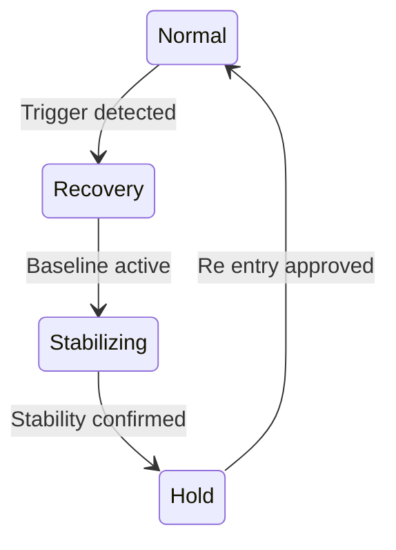

← **[Back to AI Control Safety Package](https://samizo-aitl.github.io/ai-control-safety-package/)**

# Recovery Control Design

## Role in This Package

**Recovery Control Design** is the **final step** of the  
**AI Control Safety Package**.

Its purpose is to answer:

> **When things go wrong, how do we return safely — and who decides?**

This design ensures that abnormal behavior does **not**
lead to cascading failure, silent AI dependence, or undefined responsibility.

---

## Overview

**Recovery Control Design** defines how a control system **returns to a safe,
stable, and explainable state** after abnormal behavior, disturbances,
degradation, or unexpected operating conditions.

The objective is **not automatic optimization**, but **controlled recovery**
with clear responsibility and deterministic behavior.

Recovery is treated as a **designed mode**, not an exception.

---

## Conceptual Recovery Flow (Mermaid Overview)

Recovery is handled by **explicit supervisory logic**,  
independent of AI judgment.

**Design intent:**

- Any trigger forces exit from Normal operation
- AI has **no authority** during Recovery
- Return to Normal is **never automatic**
- Approval is required for re-entry

---

## What Is Recovery Control

Recovery Control is the explicit design of:

- **When** the system is considered degraded or abnormal
- **How** normal operation is suspended or limited
- **Which path** the system follows to return to a safe baseline
- **Who decides** when recovery is complete

Recovery always prioritizes **safety and predictability** over continuity.

---

## Design Scope

### 1. Recovery Triggers
- Detection of abnormal behavior or envelope violation
- Performance degradation beyond allowed limits
- Loss of confidence in AI-assisted decisions
- External or manual recovery requests

Triggers are **explicit and conservative**.

---

### 2. Recovery Modes
- Dedicated **Recovery Mode** distinct from normal operation
- Reduced authority and simplified control structure
- Clear separation from AI-assisted or adaptive modes

Recovery modes are **finite, deterministic, and explainable**.

---

### 3. Fallback and Baseline Control
- Transition to fixed, well-understood baseline controllers
- Guaranteed operability without AI involvement
- Known-safe behavior with bounded performance

Baseline control is a **design guarantee**, not a failure state.

---

### 4. Controlled Re-Entry
- Criteria for exiting Recovery Mode
- Optional and bounded re-enablement of AI functions
- Human approval or supervisory confirmation when required

Re-entry is **explicit**, never automatic.

---

## Example: Recovery Control for AI-Assisted Process Control

*(Example details intentionally omitted here.  
Examples are used only to validate recovery logic,
not to justify AI usage.)*

---

## What This Design Does NOT Do

- No unrestricted self-healing
- No AI-driven recovery completion
- No silent failure masking
- No guarantee of uninterrupted performance

Recovery favors **clarity over continuity**.

---

## Deliverables

You will receive:

- Recovery trigger definitions
- Recovery mode structure and FSM transitions
- Fallback and baseline control definition
- Controlled re-entry criteria
- A **Recovery Control design summary** (PDF or Markdown)

---

## Typical Use Cases

- Long-term operation with degradation or drift
- Systems requiring reversible AI involvement
- Preparation for abnormal events
- Accountability after unexpected behavior

---

## Engagement Details

- Format: Design discussion + analysis
- Duration: 2–3 hours
- Fee guideline: **JPY 150,000 – 400,000**

---

## Important Note

A system that cannot **recover deterministically**
is not suitable for AI-assisted control.

If safe recovery cannot be defined,
AI involvement should be **restricted or removed**.

---

📌 **Previous step:**  
→ **[Safety Envelope Design](https://samizo-aitl.github.io/ai-control-safety-package/packages/safety-envelope.html)**

📌 **Back to package overview:**  
→ **[AI Control Safety Package](https://samizo-aitl.github.io/ai-control-safety-package/)**

---

## Contact

📧 [shinichi.samizo2@gmail.com](mailto:shinichi.samizo2@gmail.com)  
🌐 [samizo-aitl.github.io](https://samizo-aitl.github.io/)
