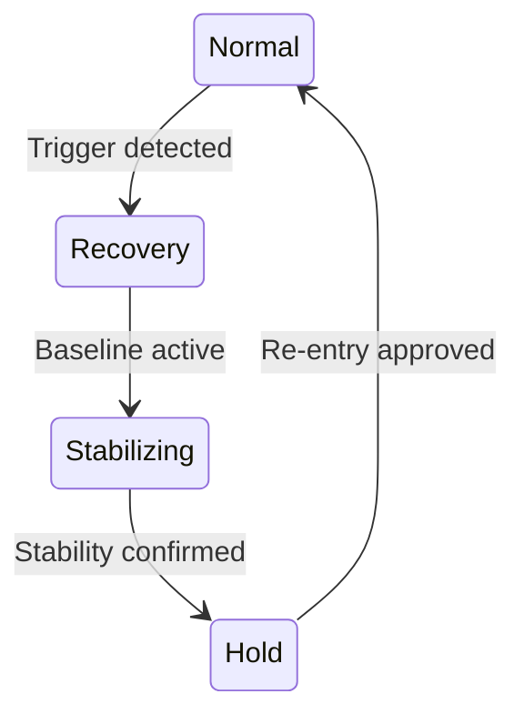

← **[Back to AI Control Safety Package](https://samizo-aitl.github.io/ai-control-safety-package/)**

# 🔁 Recovery Control Design

## 🎯 Role in This Package

**Recovery Control Design** is the **final step** of the  
**AI Control Safety Package**.

Its role is to answer one critical question:

> ❓ **When things go wrong, how do we return safely — and who decides?**

This design step ensures that abnormal behavior does **not** lead to:

- ❌ Cascading failure
- ❌ Silent dependence on AI
- ❌ Undefined or ambiguous responsibility

Recovery is treated as a **designed, governed process**,  
not as an emergency improvisation.

---

## 🧠 Overview

**Recovery Control Design** defines how a control system returns to a:

- 🧯 Safe
- 🧱 Stable
- 🧭 Explainable

state after abnormal behavior, disturbances, degradation,  
or unexpected operating conditions.

The objective is **not automatic optimization**.

The objective is:

> **Controlled, deterministic recovery with clear responsibility**

Recovery is treated as a **first-class operational mode**,  
not as an exception.

---

## 🏗️ Conceptual Recovery Flow  
### *Recovery is explicit and supervised*

Recovery behavior is governed by **explicit supervisory logic**,  
fully independent of AI judgment.

### Design intent

- ⚠️ Any trigger forces exit from Normal operation
- 🚫 AI has **no authority** during Recovery
- 🔒 Return to Normal is **never automatic**
- 🧭 Explicit approval is required for re-entry

---

## 🧩 What Is Recovery Control

**Recovery Control** is the explicit design of:

- ⏱️ **When** the system is considered degraded or abnormal
- 🧯 **How** normal operation is suspended or limited
- 🛣️ **Which path** the system follows to reach a safe baseline
- 👤 **Who decides** when recovery is complete

Recovery always prioritizes:

> **Safety · Predictability · Accountability**

over continuity or performance.

---

## 🔍 Design Scope

### 1️⃣ Recovery Triggers
Explicit conditions that force entry into Recovery Mode:

- Detection of abnormal behavior or envelope violation
- Performance degradation beyond allowed limits
- Loss of confidence in AI-assisted decisions
- External or manual recovery requests

Triggers are **explicit, conservative, and reviewable**.

---

### 2️⃣ Recovery Modes
- Dedicated **Recovery Mode** clearly separated from Normal operation
- Reduced authority and simplified control structure
- Complete separation from AI-assisted or adaptive modes

Recovery modes are:

> **Finite · Deterministic · Explainable**

---

### 3️⃣ Fallback & Baseline Control
- Transition to fixed, well-understood baseline controllers
- Guaranteed operability **without AI involvement**
- Known-safe behavior with bounded performance

Baseline control is a **design guarantee**,  
not a failure or degraded feature.

---

### 4️⃣ Controlled Re-Entry
- Explicit criteria for exiting Recovery Mode
- Optional, bounded re-enablement of AI functions
- Human approval or supervisory confirmation when required

Re-entry is:

> 🔒 **Explicit**  
> 🚫 **Never automatic**

---

## 🧪 Example: Recovery Control for AI-Assisted Process Control

*(Example details are intentionally omitted.)*

Examples are used **only** to validate recovery logic  
—not to justify AI usage.

---

## 🚫 What This Design Does NOT Do

This design explicitly avoids:

- Unrestricted self-healing
- AI-driven recovery completion
- Silent failure masking
- Guarantees of uninterrupted performance

Recovery favors:

> **Clarity over continuity**

---

## 📦 Deliverables

You will receive:

- 🔔 Recovery trigger definitions
- 🔁 Recovery mode structure and FSM transitions
- 🧱 Fallback and baseline control definition
- 🧭 Controlled re-entry criteria
- 📄 A **Recovery Control design summary** (PDF or Markdown)

---

## 🧑‍💼 Typical Use Cases

- Long-term operation with degradation or drift
- Systems requiring reversible AI involvement
- Preparation for abnormal or off-nominal events
- Accountability after unexpected system behavior

---

## 💼 Engagement Details

| Item | Details |
|----|--------|
| **Format** | Design discussion + analysis |
| **Duration** | 2–3 hours |
| **Fee guideline** | **JPY 150,000 – 400,000** |

---

## ⚠️ Important Note

A system that cannot **recover deterministically**  
is **not suitable** for AI-assisted control.

If safe recovery cannot be explicitly defined,  
AI involvement must be:

> 🚫 **Restricted or removed**

---

📌 **Previous step:**  
→ **[Safety Envelope Design](https://samizo-aitl.github.io/ai-control-safety-package/packages/safety-envelope.html)**

📌 **Back to package overview:**  
→ **[AI Control Safety Package](https://samizo-aitl.github.io/ai-control-safety-package/)**

---

## 📬 Contact

📧 [shinichi.samizo2@gmail.com](mailto:shinichi.samizo2@gmail.com)  
🌐 [samizo-aitl.github.io](https://samizo-aitl.github.io/)
