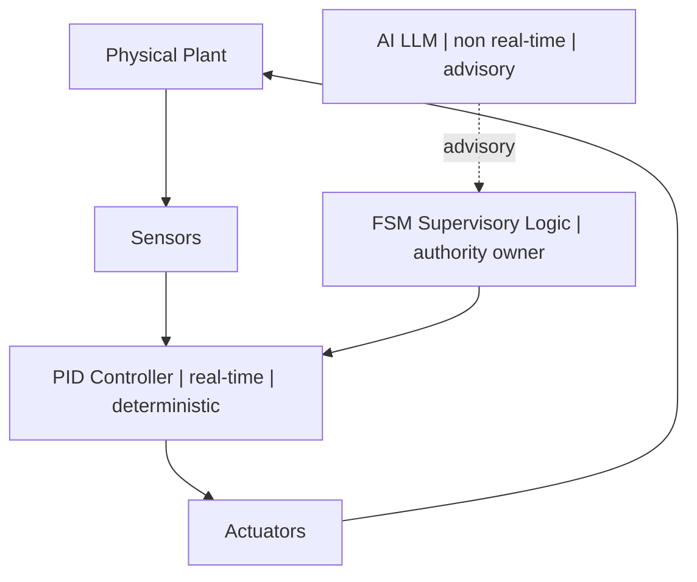

← **[Back to AI Control Safety Package](https://samizo-aitl.github.io/ai-control-safety-package/)**

# 🚦 AI Control Risk Review

## 🎯 Role in This Package

**AI Control Risk Review** is the **entry point** of the  
**AI Control Safety Package**.

Its role is intentionally narrow and strict.  
It answers **one question only**:

> ❓ **Should AI be allowed in this control system at all?**

The outcome is an explicit:

> **Go / Conditional Go / No-Go**

This judgment is based on **architecture, authority, and responsibility**  
—not on optimism, performance claims, or AI capability.

---

## 🧠 Overview

The **AI Control Risk Review** is a **design-level architectural assessment**  
that determines whether an AI / LLM-based control concept is:

| Judgment | Meaning |
|--------|---------|
| ✅ **Go** | Structurally acceptable as proposed |
| ⚠️ **Conditional Go** | Acceptable only with explicit constraints |
| ❌ **No-Go** | Structurally unsafe by design |

This review focuses exclusively on:

- 🧱 Architecture
- 👤 Responsibility and authority
- 🧯 Failure handling and fallback logic

It explicitly **does NOT** evaluate:
- Control tuning quality
- Model accuracy or training data
- Performance optimization

---

## 🏗️ Architectural Intent  
### *Where AI is placed — and where it is not*

The core question of this review is:

> **Does AI ever hold real authority over the physical system?**

### ✅ Required design intent

- ⏱️ AI is **never** in the real-time control loop  
- 🧠 AI outputs are **advisory only**
- 🧭 FSM (or equivalent logic) owns **final authority**
- 📴 The system remains safe with AI **fully disabled**

⚠️ If **any** of these conditions cannot be satisfied,  
the correct outcome of this review is:

> ❌ **No-Go**

---

## 🔍 Scope of Review

### 1️⃣ AI / LLM Placement
- Is AI strictly **outside** real-time control loops?
- Are timing, determinism, and failure modes clearly separated?

### 2️⃣ Stop & Fallback Mechanisms
- Are explicit **stop conditions** defined?
- Can the system operate safely with AI fully disabled?

### 3️⃣ Supervisory Logic & Authority
- Is there a deterministic supervisory layer (FSM, rule-based logic)?
- Is decision authority clearly assigned and enforced?

### 4️⃣ Failure & Responsibility
- Are AI failure scenarios explicitly assumed?
- Who is responsible when AI advice is rejected or ignored?

### 5️⃣ Long-Term Operation
- Are degradation, drift, or unexpected conditions considered?
- Is AI adaptation bounded, restricted, or supervised?

---

## 🧪 Example: AI-Assisted Control (Illustrative)

*(This section is intentionally omitted here.)*

Examples are used **only** to validate architecture,  
**never** to justify AI usage.

---

## 🚫 What This Review Does NOT Cover

This review does **not** include:

- Control performance tuning
- Model training or dataset evaluation
- Safety certification or regulatory compliance
- Implementation or code-level debugging

This is a **design judgment**,  
not an implementation service.

---

## 📦 Deliverables

You will receive:

- 🚦 **Go / Conditional Go / No-Go judgment**
- 🧱 Structural risk identification
- 🧭 Recommended next steps (if applicable)
- 📄 A **1–2 page written summary** (PDF or Markdown)

---

## 🧑‍💼 Typical Use Cases

- Before introducing AI into an existing control system
- When management demands AI adoption without safety criteria
- When technical responsibility is unclear
- As an external **architectural sanity check**

---

## 💼 Engagement Details

| Item | Details |
|----|--------|
| **Format** | Design discussion + document review |
| **Duration** | 1–2 hours |
| **Fee guideline** | **JPY 50,000 – 100,000** |

---

## ⚠️ Important Note

A **No-Go** judgment is a **valid and responsible outcome**.

It means the design **must not be deployed**  
without structural changes.

This review exists to **prevent unsafe optimism**,  
not to enable AI usage at any cost.

---

📌 **Next step in this package:**  
→ **[Safety Envelope Design](https://samizo-aitl.github.io/ai-control-safety-package/packages/safety-envelope.html)**

---

## 📬 Contact

📧 [shinichi.samizo2@gmail.com](mailto:shinichi.samizo2@gmail.com)  
🌐 [samizo-aitl.github.io](https://samizo-aitl.github.io/)
