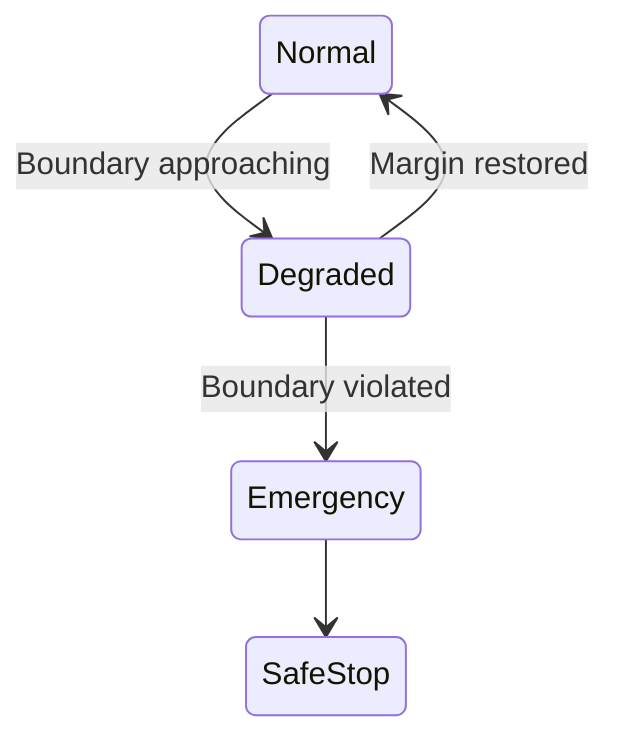

← **[Back to AI Control Safety Package](https://samizo-aitl.github.io/ai-control-safety-package/)**

# 🧱 Safety Envelope Design

## 🎯 Role in This Package

**Safety Envelope Design** is the **second step** of the  
**AI Control Safety Package**.

Its role is to answer the following question:

> ❓ **If AI is allowed, where must it be strictly constrained?**

This design step defines **hard operational boundaries**  
that AI-assisted control **must never violate**.

It translates the **Go / Conditional Go judgment**  
into **explicit, enforceable limits**.

---

## 🧠 Overview

**Safety Envelope Design** defines and enforces the  
**operational boundaries** within which an AI / LLM-assisted
control system is allowed to operate.

The objective is **not** performance improvement.

The objective is to ensure that:

> ⚠️ **AI involvement can never push the system outside predefined safe regions**

Safety boundaries are treated as:

- 🧱 **First-class design elements**
- 🧭 Explicit architectural constraints
- 🧯 Independent of AI correctness or intent

---

## 🏗️ Conceptual Structure  
### *Where the envelope lives*

Safety Envelope enforcement is:

- 🚫 Outside AI logic  
- 🧭 Above real-time control execution  
- ⏱️ Independent of control loop timing  

### Key design principles

- 🧠 AI has **no direct control authority**
- 🧭 FSM enforces envelope boundaries
- ⏱️ PID remains deterministic and bounded
- 📴 Envelope enforcement does **not** depend on AI correctness

---

## 🧩 What Is a Safety Envelope

A **Safety Envelope** is the explicitly defined set of conditions  
under which the system is allowed to operate.

It defines **where control is permitted**.

Everything outside the envelope is **explicitly disallowed**.

### Typical envelope dimensions

- 📐 Physical limits  
  (position, velocity, force, current, voltage)
- ⏱️ Timing limits  
  (response delay, settling time, update intervals)
- 🎚️ Control authority limits  
  (gain ranges, output saturation)
- 🔄 Operational modes and transitions
- 🌡️ Environmental or aging assumptions

The envelope is **conservative by design**  
and reflects **responsibility, not optimism**.

---

## 🔍 Design Scope

### 1️⃣ Envelope Definition
- Identification of critical variables and limits
- Separation of:
  - Normal region
  - Degraded region
  - Emergency region
- Boundary setting based on **assumed failure responsibility**

### 2️⃣ Pre-Violation Detection
- Boundary-approach detection
- Margin- and trend-based logic
- Early intervention **before** violation occurs

### 3️⃣ Supervisory Enforcement
- FSM-based envelope supervision
- Deterministic enforcement actions
- Clear separation from AI advisory logic

### 4️⃣ Enforcement Actions
- Authority clamping
- Mode downgrade or fallback
- Complete AI disengagement when required

---

## 🧪 Example: Safety Envelope for AI-Assisted Thermal Control

*(Example details are intentionally omitted.)*

Examples are used **only** to validate envelope logic  
—not to justify AI usage.

---

## 🚫 What This Design Does NOT Do

This design explicitly does **not** include:

- Control performance optimization
- AI-based safety judgment
- Assumptions of perfect models or predictions
- Replacement of certified safety systems

The Safety Envelope is:

> **Hard · Explicit · Conservative**

---

## 📦 Deliverables

You will receive:

- 🧱 Safety Envelope specification
- 📐 Boundary definitions and limits
- 🧭 Supervisory structure and FSM logic
- ⚠️ Pre-violation and violation actions
- 📄 A **design summary document** (PDF or Markdown)

---

## 🧑‍💼 Typical Use Cases

- Introducing AI into safety-critical systems
- Preventing AI-driven overreach
- Explaining and defending limited AI authority
- Preparing for audits or internal safety reviews

---

## 💼 Engagement Details

| Item | Details |
|----|--------|
| **Format** | Design discussion + system review |
| **Duration** | 2–3 hours |
| **Fee guideline** | **JPY 100,000 – 300,000** |

---

## ⚠️ Important Note

Safety Envelopes are intentionally **restrictive**.

If AI cannot operate within the envelope,  
the correct design choice is to:

> 🚫 **Limit or disable AI involvement**

---

📌 **Previous step:**  
→ **[AI Control Risk Review](https://samizo-aitl.github.io/ai-control-safety-package/packages/risk-review.html)**

📌 **Next step:**  
→ **[Recovery Control Design](https://samizo-aitl.github.io/ai-control-safety-package/packages/recovery-control.html)**

---

## 📬 Contact

📧 [shinichi.samizo2@gmail.com](mailto:shinichi.samizo2@gmail.com)  
🌐 [samizo-aitl.github.io](https://samizo-aitl.github.io/)
