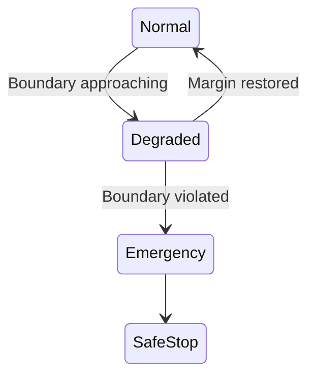

← **[Back to AI Control Safety Package](https://samizo-aitl.github.io/ai-control-safety-package/)**

# Safety Envelope Design

## Role in This Package

**Safety Envelope Design** is the **second step** of the  
**AI Control Safety Package**.

Its purpose is to answer:

> **If AI is allowed, where must it be strictly constrained?**

This design defines **hard operational boundaries**
that AI-assisted control **must never violate**.

---

## Overview

**Safety Envelope Design** defines and enforces the **operational boundaries**
within which an AI / LLM-assisted control system is allowed to operate.

The goal is **not** to improve performance, but to ensure that
AI involvement **never drives the system outside predefined safe regions**.

Safety boundaries are treated as **first-class design elements**,
not as afterthoughts.

---

## Conceptual Structure (Mermaid Overview)

The Safety Envelope is enforced **outside AI logic**  
and **above real-time control execution**.

**Key points:**

- AI has **no direct control authority**
- FSM enforces envelope boundaries
- PID remains deterministic and bounded
- Envelope enforcement does **not** depend on AI correctness

---

## What Is a Safety Envelope

A **Safety Envelope** is the explicitly defined set of conditions
under which the system is allowed to operate.

Typical envelope dimensions include:

- Physical limits (position, velocity, force, current, voltage)
- Timing limits (response delay, settling time, update intervals)
- Control authority limits (gain ranges, output saturation)
- Operational modes and transitions
- Environmental or aging assumptions

The envelope defines **where control is allowed**.  
Everything outside the envelope is **explicitly disallowed**.

---

## Design Scope

### 1. Envelope Definition
- Identification of critical variables and limits
- Normal, degraded, and emergency regions
- Conservative boundary setting based on responsibility

### 2. Pre-Violation Detection
- Boundary approach detection
- Margin- and trend-based logic
- Early intervention before violation

### 3. Supervisory Enforcement
- FSM-based envelope supervision
- Deterministic enforcement actions
- Clear separation from AI advisory logic

### 4. Enforcement Actions
- Authority clamping
- Mode downgrade or fallback
- Complete AI disengagement if required

---

## Example: Safety Envelope for AI-Assisted Thermal Control

*(Example details intentionally omitted here.  
Examples are used only to validate envelope logic,
not to justify AI usage.)*

---

## What This Design Does NOT Do

- No control performance optimization
- No AI-based safety judgment
- No assumption of perfect models
- No replacement of certified safety systems

The envelope is **hard, explicit, and conservative**.

---

## Deliverables

You will receive:

- Safety Envelope specification
- Boundary and enforcement definitions
- Supervisory structure and FSM logic
- Pre-violation and violation actions
- A **design summary document** (PDF or Markdown)

---

## Typical Use Cases

- Introducing AI into safety-critical systems
- Preventing AI-driven overreach
- Explaining why AI authority is limited
- Preparing for audits or internal safety reviews

---

## Engagement Details

- Format: Design discussion + system review
- Duration: 2–3 hours
- Fee guideline: **JPY 100,000 – 300,000**

---

## Important Note

Safety Envelopes are intentionally **restrictive**.

If AI cannot operate within the envelope,
the correct design choice is to **limit or disable AI involvement**.

---

📌 **Previous step:**  
→ **[AI Control Risk Review](https://samizo-aitl.github.io/ai-control-safety-package/packages/risk-review.html)**

📌 **Next step:**  
→ **[Recovery Control Design](https://samizo-aitl.github.io/ai-control-safety-package/packages/recovery-control.html)**

---

## Contact

📧 [shinichi.samizo2@gmail.com](mailto:shinichi.samizo2@gmail.com)  
🌐 [samizo-aitl.github.io](https://samizo-aitl.github.io/)
