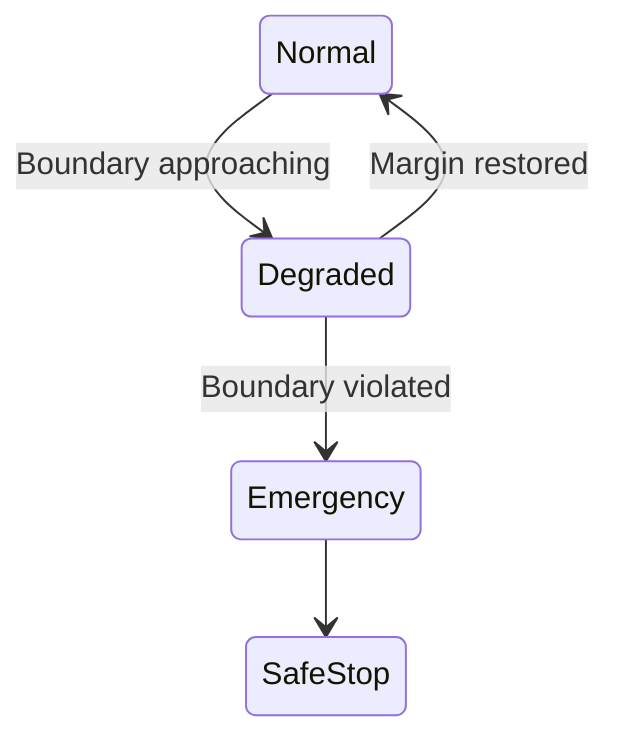

# Safety Envelope Design

## Overview

**Safety Envelope Design** defines and enforces the **operational boundaries**
within which an AI / LLM-assisted control system is allowed to operate.

The goal is **not** to improve performance, but to ensure that
AI involvement **never drives the system outside predefined safe regions**.

This design treats safety boundaries as **first-class design elements**,
not as afterthoughts.

---

## What Is a Safety Envelope

A **Safety Envelope** is the explicitly defined set of conditions
under which the system is allowed to operate.

Typical envelope dimensions include:

- Physical limits (position, velocity, force, current, voltage)
- Timing limits (response delay, settling time, update intervals)
- Control authority limits (gain ranges, output saturation)
- Operational modes and transitions
- Environmental or aging assumptions

The envelope defines **where control is allowed**.  
Everything outside the envelope is **explicitly disallowed**.

---

## Design Scope

The Safety Envelope Design covers:

### 1. Envelope Definition
- Identification of critical variables and limits
- Normal, degraded, and emergency regions
- Conservative boundary setting based on system responsibility

### 2. Pre-Violation Detection
- Detection of approach toward envelope boundaries
- Margin-based or trend-based detection
- Early intervention **before** violations occur

### 3. Supervisory Enforcement
- FSM-based supervision of envelope status
- Deterministic actions on boundary approach
- Clear separation between AI suggestion and control execution

### 4. Enforcement Actions
- Limiting or clamping control authority
- Mode downgrade or fallback activation
- Complete AI disengagement when required

---

## Example: Safety Envelope for AI-Assisted Thermal Control

### System Context (Example)

- Target system: Industrial thermal process
- Base control: PID (real-time)
- Supervisory control: FSM
- AI role: Trend prediction and recovery proposal (non-real-time)

AI does **not** directly control actuators.

---

### Envelope Definition (Example)

| Variable | Normal Region | Degraded Region | Disallowed |
|--------|---------------|-----------------|------------|
| Temperature | 30 – 70 °C | 25 – 80 °C | <25, >80 |
| Pressure | 0.2 – 1.5 MPa | 0.1 – 2.0 MPa | <0.1, >2.0 |
| Control Output | ±70 % | ±90 % | >±90 % |
| AI Confidence | ≥ 0.7 | 0.5 – 0.7 | <0.5 |

- **Normal**: full operation allowed  
- **Degraded**: restricted authority  
- **Disallowed**: immediate enforcement action  

---

### Pre-Violation Detection

Envelope approach is detected using:

- Margin monitoring (distance to boundary)
- Rate-of-change monitoring (trend)
- Short-horizon deterministic prediction

**Example rule:**

If temperature is projected to exceed **80 °C within 10 seconds**  
→ trigger *pre-violation* state.

---

### Supervisory Enforcement (FSM)

- FSM owns **authority decisions**
- AI output is **advisory only**
- State transitions are deterministic and logged

---

### Enforcement Actions (Example)

| Envelope Status | Action |
|-----------------|--------|
| Normal | AI advisory allowed |
| Degraded | Clamp control output, restrict AI |
| Emergency | Disable AI, force safe mode |
| SafeStop | Manual intervention required |

**Key rule:**  
Safety enforcement does **not** depend on AI judgment.

---

### Failure Scenario Handling

**Assumed failure:**  
AI proposes an aggressive recovery action based on incomplete data.

**System response:**
1. Envelope logic detects boundary approach  
2. FSM transitions to *Degraded* mode  
3. Control authority is clamped  
4. AI recommendation is ignored  
5. System stabilizes within safe limits  

**Outcome:**  
No envelope violation.  
No AI dependency.  
Fully explainable behavior.

---

## What This Design Does NOT Do

- It does **not** optimize control performance
- It does **not** rely on AI judgment for safety decisions
- It does **not** assume perfect models or predictions
- It does **not** replace certified safety mechanisms

The envelope is **hard**, explicit, and conservative.

---

## Deliverables

You will receive:

- A clearly defined **Safety Envelope specification**
- Boundary conditions and enforcement logic
- Recommended supervisory (FSM) structure
- Defined actions for boundary approach and violation
- A **design summary document** (PDF or Markdown)

---

## Typical Use Cases

- Introducing AI into safety-critical or long-life systems
- Preventing AI-driven overreach or instability
- Providing a defensible explanation for AI limitations
- Preparing systems for audits or internal safety reviews

---

## Engagement Details

- Format: Design discussion + system review
- Duration: 2–3 hours
- Output: Safety Envelope design summary
- Fee guideline: **JPY 100,000 – 300,000**

Exact scope and system assumptions are discussed individually.

---

## Important Note

Safety Envelopes are intentionally **restrictive**.

If an AI function cannot operate within the defined envelope,
the correct design choice is to **disable or limit AI involvement**.

---

## Contact

For Safety Envelope Design inquiries:

📧 [shinichi.samizo2@gmail.com](mailto:shinichi.samizo2@gmail.com)  
🌐 [samizo-aitl.github.io](https://samizo-aitl.github.io/)
